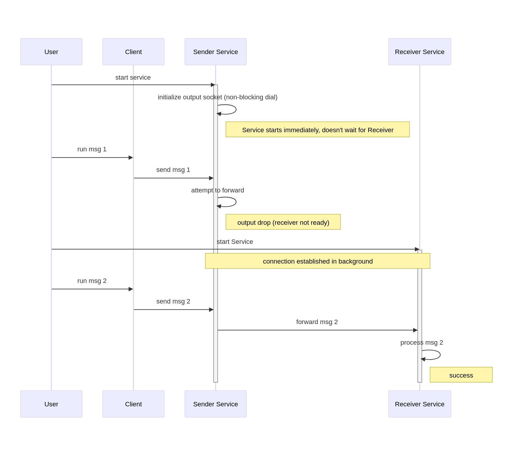

# Manual Demo Walkthrough

This directory contains scripts to demonstrate the **non-blocking output connection** and **automatic reconnection** features of the DetectMate Service.

## Components

| File | Description |
|------|-------------|
| `config/sender.yaml` | Configuration for the **Sender** service. It is configured to output messages to the Receiver. |
| `config/receiver.yaml` | Configuration for the **Receiver** service. |
| `client.py` | A simple Python script that connects to the Sender and sends a custom text message. |
| `run_demo_scenario.sh` | Orchestration script that automates the test scenario described below. |

## Scenario

The scenario demonstrates that the **Sender** service can start up successfully even if the **Receiver** service (its output destination) is offline. It also shows that once the Receiver comes online, the Sender automatically connects and begins forwarding messages.

### Sequence Diagram



## Running the Demo

Run the automated scenario script:

```bash
bash scripts/run_demo_scenario.sh
```

### Expected Output

1. **Sender Starts**: You will see the Sender start successfully.
2. **Msg 1**: The client sends a message. The Sender log will show it, but it will be dropped (warning log) because the output is down.
3. **Receiver Starts**: The Receiver service starts up.
4. **Msg 2**: The client sends a second message. The Sender log will show it being sent, and the Receiver log will show it being received.

You can inspect the detailed logs in the `logs/` directory created during the run:
- `logs/sender.log`
- `logs/receiver.log`
